# 如何进行分支操作

## 代码拉取

### 拉取 

1. 先确保处于主分支
   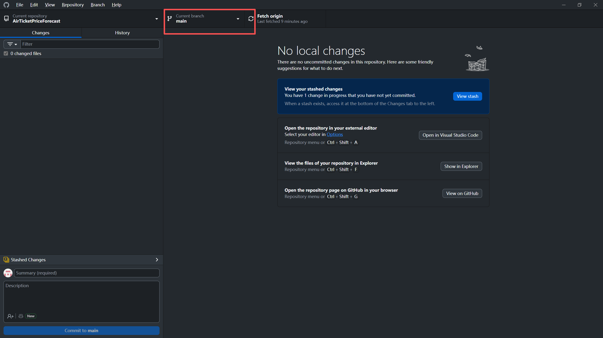
2. 从仓库拉取代码
   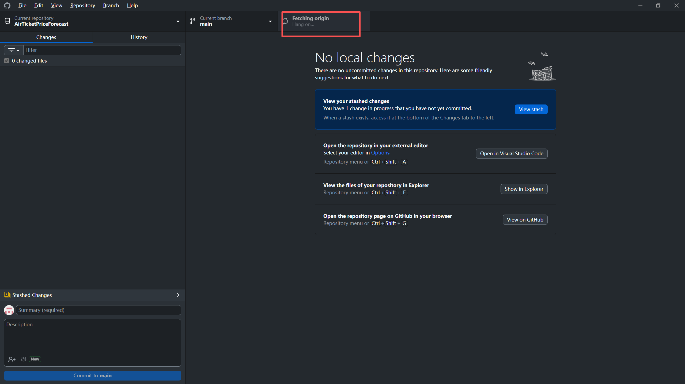

### 合并

3. 切换回自己分支
   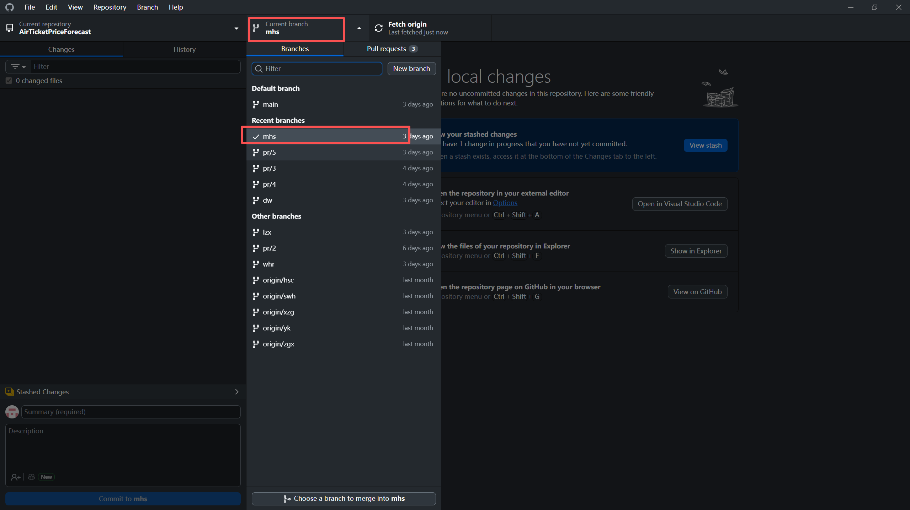
4. 将主分支合并到自己分支
   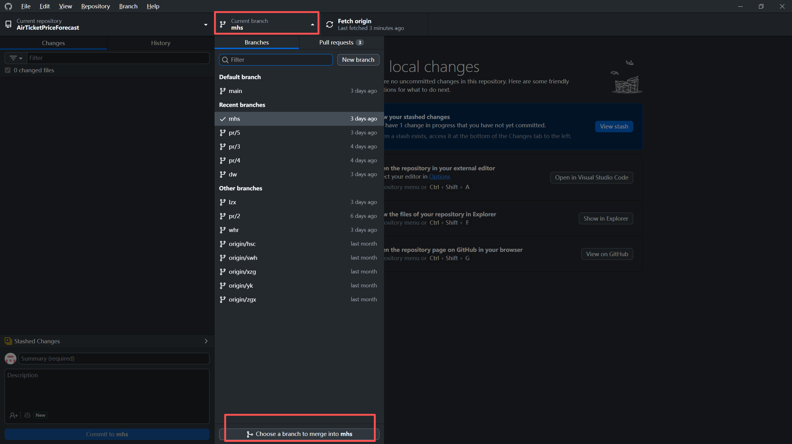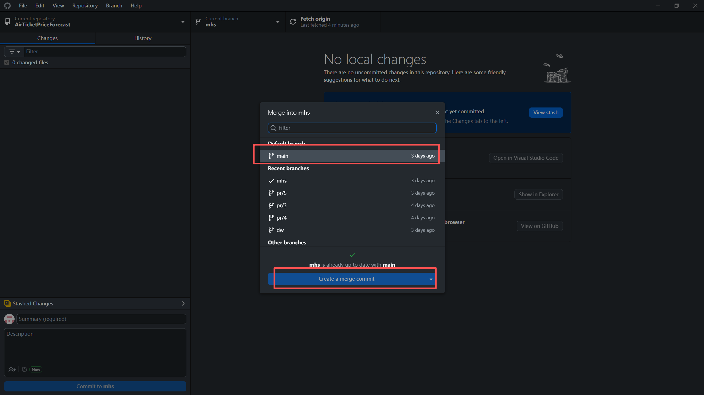

## 提交代码

5. `README.md`随便改点东西
   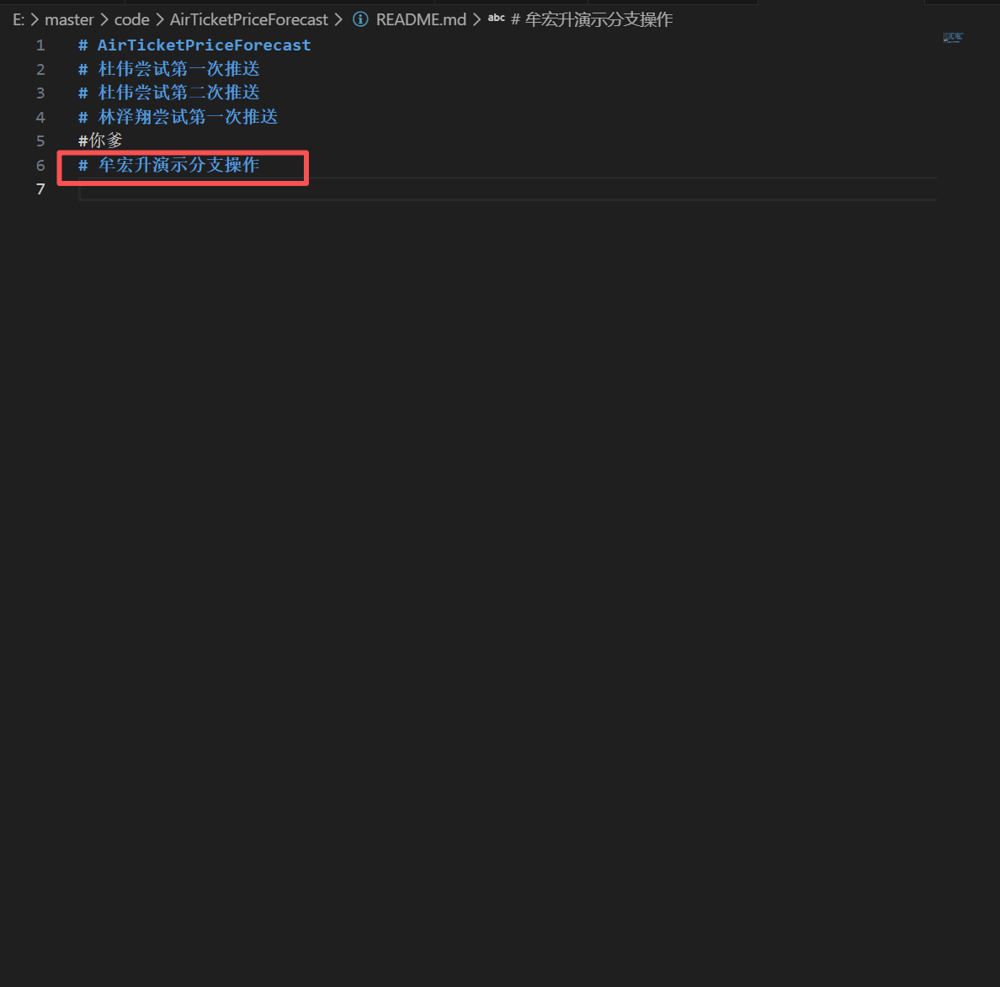
6. 在提交标题里***伪造***本周任务完成情况
   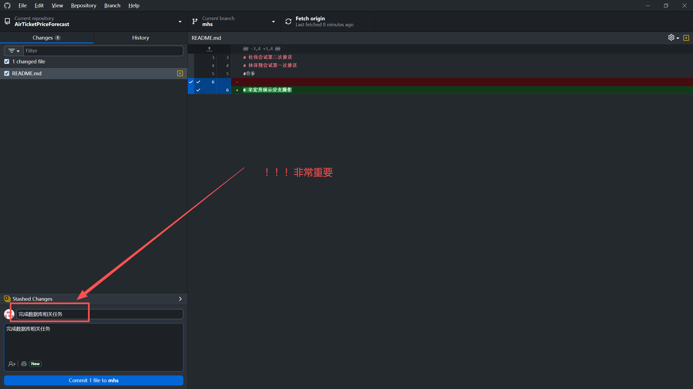

## 代码推送

### 推送

7. 提交并推送至仓库
   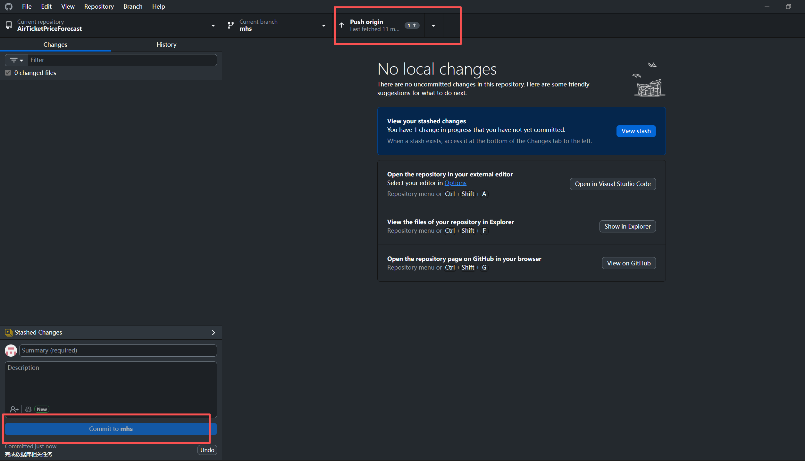

### 合并

8. 切换回主分支
   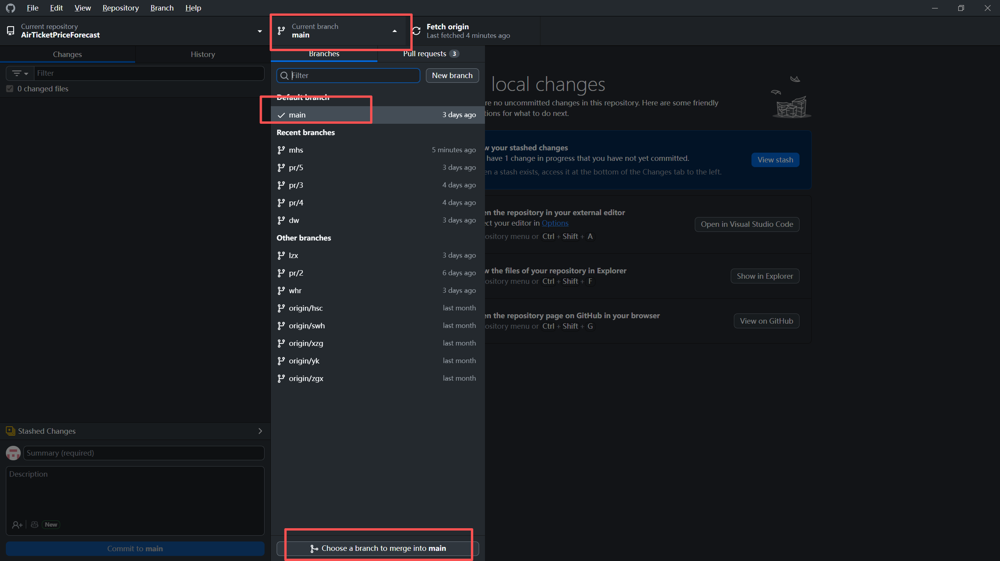
9. 将自己分支合并到主分支
   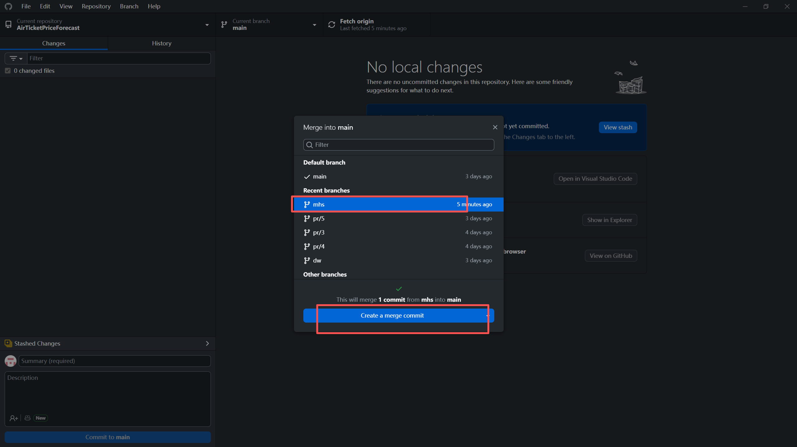
10. 推送到仓库
    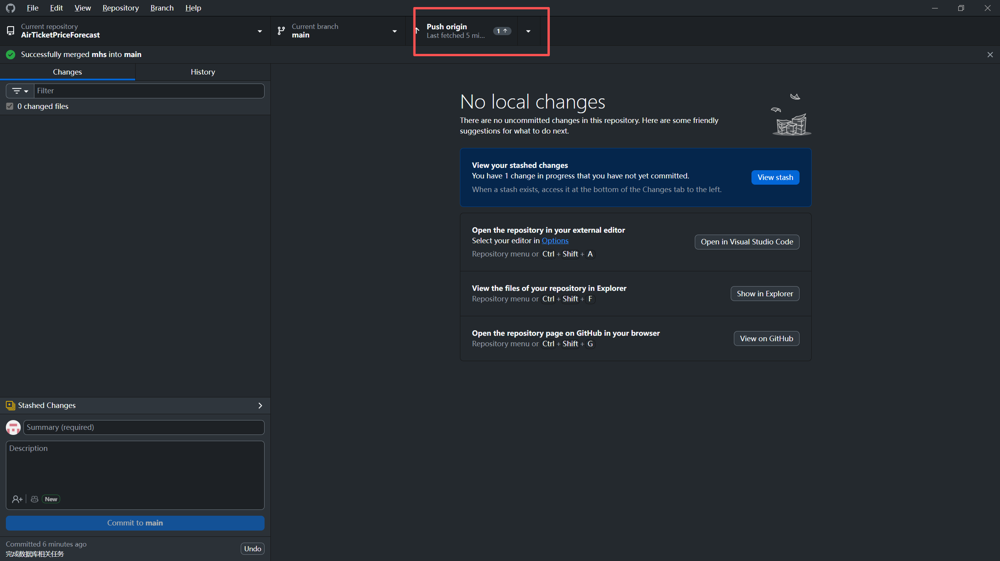 

## 总结

**至此完成了一次代码提交**
- 先将别人的代码更新到自己的分支
- 再在自己的分支上修改
- 最后将自己的改动更新到主分支
- 这就是完整的一次代码提交